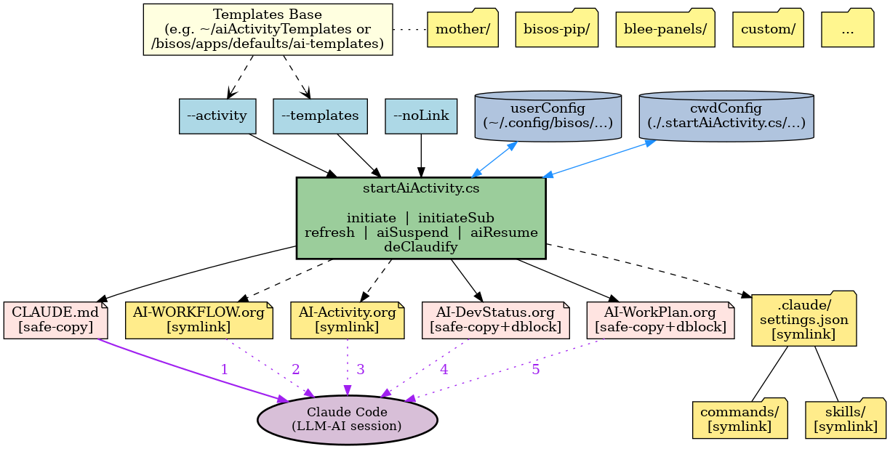

#+title: bisos.startAiActivity: Install AI Collaborative Development Templates
#+DATE: <2026-07-12 Sat>
#+AUTHOR: Mohsen BANAN
#+OPTIONS: toc:4

#+BEGIN: b:org:pypi:readme/topControls :pkgName "startAiActivity" :comment "basic"

|----------------------+------------------------------------------------------------------|
| ~Blee Panel Controls~: | [[elisp:(show-all)][Show-All]] : [[elisp:(org-shifttab)][Overview]] : [[elisp:(progn (org-shifttab) (org-content))][Content]] : [[elisp:(delete-other-windows)][(1)]] : [[elisp:(progn (save-buffer) (kill-buffer))][S&Q]] : [[elisp:(save-buffer)][Save]]  : [[elisp:(kill-buffer)][Quit]]  : [[elisp:(bury-buffer)][Bury]] |
| ~Panel Links~:         | [[file:./py3/panels/bisos.startAiActivity/_nodeBase_/fullUsagePanel-en.org][Repo Blee Panel]] --  [[file:/bxRepos/bisos-pip/startAiActivity/py3/panels/bisos.startAiActivity/_nodeBase_/fullUsagePanel-en.org][Blee Panel]]                                   |
| ~See Also~:            | [[https://pypi.org/project/bisos.startAiActivity][At PYPI]] : [[https://github.com/bisos-pip/pycs][bisos.PyCS]]                                             |
|----------------------+------------------------------------------------------------------|

#+END:

* The Concept and Model of an AI-Activity

An *AI-Activity* is a durable, collaborative effort between a human and
an AI assistant (Claude Code) toward a specific purpose --- writing a
document, building new software, enhancing existing software, and so on.
Unlike a one-shot chat, an activity is expected to span many sessions,
possibly across machines and over long stretches of time. Its state,
conventions, and progress live in files under version control rather
than in any one session's memory.

Two org-mode files encode the activity, playing distinct roles:

- =AI-Activity.org= describes the human's *usual way of doing that kind
  of work* --- their conventions, preferred libraries, patterns, and
  gotchas. It is *reusable*: symlinked from a shared activity template
  so the same conventions apply to every project of that kind. Examples
  of concrete activities: =bisos-pip= (Python package authorship),
  =xu-single= (single-XU PyCS scripts), =blee-panels= (Blee panel
  authorship), =lcnt= (LaTeX content).
- =AI-WorkPlan.org= describes *this specific effort* --- what will be
  built or written, broken into stages with TODOs. It is per-effort:
  edited freely, org-archived as work completes, and paired with
  =AI-DevStatus.org= which records where the effort stands right now.

Activities are classes of work; WorkPlans are instances. The templates
=/bisos.startAiActivity/= installs are what encode this distinction on
disk --- shared invariants and activity conventions are symlinked from a
templates repo (so improvements propagate); WorkPlan and DevStatus start
as safe-copies (so each effort owns its own state).

* Collaboration Across People and Across Sessions

The default mode of AI-assisted development today is *individualistic*.
Every new Claude Code session starts empty and re-explains its context
from scratch. A colleague picking up your work can read the code, but
not how you have been collaborating with Claude on it --- the
conventions, the running plan, the reasoning behind the last decision.
That information exists only in the session that produced it, and
disappears when the session ends.

An AI-Activity is collaborative in two symmetric senses that address
this directly. It is *human-to-human* --- one person starts the
activity, a colleague continues it later, possibly on a different
machine. And it is *human-to-AI* --- one Claude Code session begins the
work, another resumes it hours or weeks later with no memory of the
earlier one. Both are the same problem: *continuity across a
discontinuity*. The state, conventions, and open TODOs must live in
files that a fresh reader --- human or AI --- can pick up cold.

That substrate is *org-mode*, deliberately, not Markdown. Org-mode
provides what handoffs and resumptions actually need: TODOs with a real
state machine (=TODO=/=DONE=/=WAITING=/=DEFERRED=), scheduled dates and
deadlines, named anchors (=<<my-target>>=) that other files can
cross-reference, org-archive to retire completed subtrees without losing
history, and *dynamic blocks* (=begin:= ... =end:=) --- machine-generated
regions inside an otherwise hand-edited file, used here to capture
install-time context into the installed files.
Markdown can only approximate these through ad-hoc convention.
The AI-Activity model relies on the structure being real --- not
implied --- so that a colleague or a fresh Claude session can act on
=AI-WorkPlan.org= and =AI-DevStatus.org= with the same reliability the
original author had.

*Emacs is not required.* This tooling is Emacs-authored and its
authors' own use is Emacs-based (via Blee), but org-mode files are
plain text and read equally well in VS Code, IntelliJ, or any editor.
Claude Code itself is editor-agnostic. The commitment is to org-mode as
a file format, not to Emacs as an environment.

* Overview

/bisos.startAiActivity/ installs the ByStar AI collaborative development
template set --- =CLAUDE.md=, =AI-WORKFLOW.org=,
=AI-Activity.org=, =AI-DevStatus.org=, =AI-WorkPlan.org=, plus a =.claude/=
directory with =settings.json=, =commands/=, and optionally =skills/= ---
into a project directory, git repo root, or subproject.

This package is *just the execution engine* --- the template content lives
in a separately-cloned repo
([[https://github.com/bxexamples/aiActivityTemplates]], or your own fork).
See [[#two-part-architecture-execution-engine--templates][Two-Part Architecture]] below for details.

The installed layout is *hierarchical and Claude-consumable*. Files fall
into two classes:

- *Invariants*, symlinked from =mother/= (=CLAUDE.md=,
  =AI-WORKFLOW.org=, =.claude/settings.json=, =.claude/commands/=).
  Because they are symlinks to a shared source, an edit to =mother/=
  propagates automatically to every project that has been =initiate=-d
  against that templates base.
- *Activity-specific* files, from =<activity>/= (=AI-Activity.org=
  symlinked; =AI-DevStatus.org= and =AI-WorkPlan.org= safe-copied and
  editable; optionally =.claude/skills/= symlinked from
  =<activity>/_skills/= for on-demand task-specific instructions).

Claude Code consumes this hierarchy automatically. On startup it walks
upward from the current working directory collecting every =CLAUDE.md=,
which in turn imports (imports =AI-WORKFLOW.org= +
=AI-Activity.org= + =AI-DevStatus.org= + =AI-WorkPlan.org= via =@=
directives). Nested subprojects installed with =initiateSub= use a slim
=CLAUDE.md= that imports only the local trio; the invariants are
inherited from an ancestor via the same walk-up, avoiding duplication.

bisos.startAiActivity is a python package that uses the [[https://github.com/bisos-pip/pycs][PyCS-Framework]].
It provides the =startAiActivity.cs= command with the following operations:
=userConfig_set/get= (global user persistent config), =cwdConfig_set/get=
(per-directory persistent config), =initiate= (base install),
=initiateSub= (slim subproject overlay), =aiSuspend= / =aiResume=
(reversible pause/restore), =refresh= (re-copy =CLAUDE.md= from templates),
=deClaudify= (permanent removal), and =examples= (all invocations with
the current templates base and cwdConfig state).

** Structure at a Glance

The figure below shows how the pieces fit together --- one static
picture of everything =bisos.startAiActivity= consumes and produces,
from templates at the top to a Claude Code session at the bottom.

*Reading the figure, top to bottom:*

- *Templates layer.* The templates base (e.g. =~/aiActivityTemplates=)
  contains =mother/= (invariants shared by every activity) alongside
  the activity directories (=bisos-pip/=, =blee-panels/=, =custom/=,
  ...). One dotted connector from base to =mother/= stands in for the
  same relationship to every other child.
- *Parameters layer.* =--activity=, =--templates=, =--noLink= are
  CLI inputs; =userConfig= and =cwdConfig= are persistent stores that
  supply the same values when the CLI flags are omitted.
- *Engine.* =startAiActivity.cs= with its six operations. All
  parameter inputs converge here.
- *Generated files.* What lands in the project directory when
  =initiate= runs. Six items --- five org files plus =.claude/=
  (containing =settings.json=, =commands/=, =skills/=).
- *Claude Code (bottom).* The consumer. On startup Claude Code walks
  up from your working directory, finds =CLAUDE.md= (edge *1*), and
  follows its =@= imports out to the four org files (edges *2*
  through *5*).

*Legend --- colours and edges:*

- Yellow fill = *symlink* to the templates base. Content lives
  upstream; edits to the template propagate to every installed
  project automatically.
- Pink fill = *safe-copy*. A local per-project file, yours to edit.
- Solid edge from engine to a file = safe-copy write.
- Dashed edge from engine to a file = symlink write.
- Blue bidirectional edge = read/write of a persistent store
  (=userConfig=, =cwdConfig=): read at resolution time, written by
  the =_set= commands or by =initiate= auto-persistence.
- Purple numbered edge = Claude reads this file. =1= is the walk-up
  entry (=CLAUDE.md=); =2=--=5= are the =@= imports fanned out from
  it.

* Table of Contents     :TOC:
- [[#the-concept-and-model-of-an-ai-activity][The Concept and Model of an AI-Activity]]
- [[#collaboration-across-people-and-across-sessions][Collaboration Across People and Across Sessions]]
- [[#overview][Overview]]
- [[#part-of-bisos--bystar-internet-services-operating-system][Part of BISOS — ByStar Internet Services Operating System]]
- [[#bisosstartaiactivity-is-a-command-only-pycs-facility][bisos.startAiActivity is a Command-Only PyCS Facility]]
- [[#two-part-architecture-execution-engine--templates][Two-Part Architecture: Execution Engine + Templates]]
  - [[#part-1-----the-execution-engine-this-package][Part 1 --- the execution engine (this package)]]
  - [[#part-2-----the-templates-a-separate-repo-you-clone][Part 2 --- the templates (a separate repo you clone)]]
  - [[#auto-detection-two-canonical-locations][Auto-detection: two canonical locations]]
- [[#dynamic-block-content-in-installed-files][Dynamic Block Content in Installed Files]]
- [[#post-installation-setup][Post-Installation Setup]]
  - [[#for-non-bisos-users-canonical-clone-no-config-step][For non-BISOS users: canonical clone, no config step]]
  - [[#for-bisos-users-nothing-to-do-usually][For BISOS users: nothing to do (usually)]]
- [[#installation][Installation]]
  - [[#installation-with-pip][Installation With pip]]
  - [[#installation-with-pipx][Installation With pipx]]
  - [[#post-installation-basic-testing][Post-Installation Basic Testing]]
- [[#usage][Usage]]
  - [[#self-discovery-the-examples-menu][Self-Discovery: the examples Menu]]
  - [[#set-templates-base-directory][Set Templates Base Directory]]
  - [[#per-directory-templates-override][Per-Directory Templates Override]]
  - [[#install-templates-into-a-project][Install Templates Into a Project]]
  - [[#install-a-subproject-overlay][Install a Subproject Overlay]]
  - [[#customizing-a-shared-template-file---nolink][Customizing a Shared Template File: =--noLink=]]
  - [[#skills][Skills]]
  - [[#refresh-claudemd-from-templates][Refresh CLAUDE.md From Templates]]
  - [[#suspend-and-resume-ai-collaboration][Suspend and Resume AI Collaboration]]
  - [[#remove-ai-collaboration-files][Remove AI Collaboration Files]]
  - [[#ai-activity-topology-homogeneous-heterogeneous-hierarchical-lateral][AI-Activity Topology: Homogeneous, Heterogeneous, Hierarchical, Lateral]]
    - [[#homogeneous-vs-heterogeneous][Homogeneous vs Heterogeneous]]
    - [[#hierarchical-vs-lateral][Hierarchical vs Lateral]]
- [[#key-files][Key Files]]
    - [[#startaiactivitycs][startAiActivity.cs]]
    - [[#pypi-and-github-packaging][PyPi and Github Packaging]]
- [[#documentation-and-blee-panels][Documentation and Blee-Panels]]
  - [[#bisosstartaiactivity-blee-panels][bisos.startAiActivity Blee-Panels]]
- [[#support][Support]]
- [[#planned-improvements][Planned Improvements]]

* Part of BISOS — ByStar Internet Services Operating System

Layered on top of Debian, *BISOS* (By* Internet Services Operating System)
is a unified and universal framework for developing both internet services and
software-service continuums that use internet services. See
[[https://github.com/bxGenesis/start][Bootstrapping ByStar, BISOS and Blee]]
for information about getting started with BISOS.

*BISOS* is a foundation for *The Libre-Halaal ByStar Digital Ecosystem* which
is described as a cure for losses of autonomy and privacy in a book titled:
[[https://github.com/bxplpc/120033][Nature of Polyexistentials]]

/bisos.startAiActivity/ is part of BISOS. It is a standalone package that can
be used independently of the full BISOS environment.

Within BISOS and Blee specifically, the same org-mode substrate that
underpins the AI-Activity state files extends further --- to source-code
authorship itself --- through *COMEEGA* (Collaborative Org-Mode Enhanced
Emacs Generalized Authorship). Under COMEEGA, =.cs= / =.py= / =.sh= /
=.el= source files carry org-mode structure (dblocks, headings,
docstrings-as-org) alongside the native language, so the workflow's
authorship idiom runs continuously from planning through implementation
to documentation. COMEEGA is a BISOS/Blee integration detail; outside
Blee the source files still work as ordinary Python (etc.), and the AI
Activity model itself does not depend on COMEEGA.

* bisos.startAiActivity is a Command-Only PyCS Facility

bisos.startAiActivity is a command-line tool. It is a PyCS single-unit
command service. PyCS is a framework that converges development of CLI tools
and services. PyCS is an alternative to FastAPI, Typer and Click.

bisos.startAiActivity uses the PyCS-Framework to:

1) Install AI collaborative development templates (symlinks and safe-copies)
   from a *templates repo you clone separately* (see *Two-Part Architecture*
   below) into any project directory, git repo root, or subproject.
2) Expand =b:ai:file/particulars= org-mode dynamic blocks in installed files
   using pure Python, without requiring Emacs or =bx-dblock=.
3) Manage persistent user-config parameters (e.g. the templates-clone path)
   via =~/.config/bisos/startAiActivity.cs/=.

The core of PyCS-Framework is the /bisos.b/ package (the PyCS-Foundation).
See [[https://github.com/bisos-pip/b][bisos.b]] for an overview.

* Two-Part Architecture: Execution Engine + Templates

/bisos.startAiActivity/ is deliberately split into two independently
versioned parts. Understanding this split is essential before installing.

** Part 1 --- the execution engine (this package)

This =bisos.startAiActivity= pip package contains only the *execution
engine* --- the =startAiActivity.cs= command and its supporting Python
modules. It knows how to symlink, copy, expand dblocks, and manage user
config, but it *ships with no template content*.

** Part 2 --- the templates (a separate repo you clone)

The template content --- the =mother/= baseline files plus one directory
per activity (=bisos-pip/=, =xu-single/=, =blee-panels/=, =lcnt/=, ...) ---
lives in a separate repo:

[[https://github.com/bxexamples/aiActivityTemplates]]

This is an integral part of the package. Clone it (or fork it) somewhere
on your filesystem, then point =startAiActivity.cs= at it via user config
(see *Post-Installation Setup* below).

Because the templates are versioned separately from the engine, you can:

- *Customize for your own conventions* --- fork
  =bxexamples/aiActivityTemplates=, edit the =mother/= invariants
  (CLAUDE.md contents, AI-WORKFLOW.org) or add your own
  activities, and point =startAiActivity.cs= at your fork. Your changes
  propagate to every project you =initiate= without touching the engine.
- *Update engine and templates independently* --- =pipx upgrade
  bisos.startAiActivity= and =git pull= on your templates clone are two
  separate operations.

** Auto-detection: two canonical locations

=startAiActivity.cs= probes two well-known locations *in this order* and
persists the first one that exists as the default templates base:

1. =~/aiActivityTemplates= --- the canonical per-user clone path. If you
   =git clone https://github.com/bxexamples/aiActivityTemplates
   ~/aiActivityTemplates= (or forked and cloned your fork to that
   name), the engine finds it automatically.
2. =/bisos/apps/defaults/ai-templates= --- the BISOS-provisioned system
   path. Present on BISOS systems out of the box.

If neither exists, no default is set and the user must run
=userConfig_set --parName=templates --parValue=<path>= explicitly.

The precedence is *user-first, system-second*: a personal clone at
=~/aiActivityTemplates= wins over the BISOS path even when both are
present. This lets a user working on a BISOS system point the engine at
their own fork simply by cloning it to the canonical name, with no
=userConfig_set= call needed.

* Dynamic Block Content in Installed Files

When =initiate= safe-copies =AI-DevStatus.org= and =AI-WorkPlan.org=,
the copies contain a =b:ai:file/particulars= dynamic block that is
expanded at install time to record the working directory, activity, and
companion docs --- the context a cold reader (colleague or fresh Claude
session) needs to orient itself.

The block is a snapshot: not regenerated by =refresh= or any normal
workflow. The dblock engine itself lives in a separate package,
[[https://github.com/bisos-pip/pyDblock][=bisos.pyDblock=]], which
=bisos.startAiActivity= consumes at install time. Manual regeneration
and authoring of new dblock signatures are documented there.

* Post-Installation Setup

** For non-BISOS users: canonical clone, no config step

The zero-config path:

#+begin_src bash
git clone https://github.com/bxexamples/aiActivityTemplates ~/aiActivityTemplates
#+end_src

That's it. The engine auto-detects =~/aiActivityTemplates= on first
invocation and persists it as the templates base. You can verify:

#+begin_src bash
startAiActivity.cs -i userConfig_get --parName=templates
#+end_src

If you prefer a different path, clone there instead and run
=userConfig_set= explicitly:

#+begin_src bash
git clone https://github.com/bxexamples/aiActivityTemplates /some/other/path
startAiActivity.cs -i userConfig_set --parName=templates --parValue=/some/other/path
#+end_src

If you later want to customize the templates for your own conventions,
fork the repo, edit your fork, and (if you cloned to a non-canonical
path) re-point =--parValue= at the fork.

** For BISOS users: nothing to do (usually)

BISOS provisions =/bisos/apps/defaults/ai-templates= as part of the
environment, and the engine auto-detects it. No clone or config step
needed.

To override with a personal fork on a BISOS system, either clone the
fork to =~/aiActivityTemplates= (which then takes precedence) or run
=userConfig_set= with an explicit path.

* Installation

The sources for the bisos.startAiActivity pip package are maintained at:
https://github.com/bisos-pip/startAiActivity.

The bisos.startAiActivity pip package is available at PYPI as
https://pypi.org/project/bisos.startAiActivity

You can install bisos.startAiActivity with pip or pipx.

** Installation With pip

If you need access to bisos.startAiActivity as a python module, you can
install it with pip:

#+begin_src bash
pip install bisos.startAiActivity
#+end_src

** Installation With pipx

If you only need access to bisos.startAiActivity on command-line, you can
install it with pipx:

#+begin_src bash
pipx install bisos.startAiActivity
#+end_src

The following commands are made available:

- =startAiActivity.cs= — installs AI collaborative development templates

** Post-Installation Basic Testing

After installation, run:

#+begin_src bash
startAiActivity.cs
startAiActivity.cs -i userConfig_get --parName=templates
#+end_src

The first line invokes =startAiActivity.cs= with no arguments and
produces the *examples menu* --- the self-documenting list of common
invocations, generated from the current environment (resolved templates
base, persisted =userConfig= and =cwdConfig= values, discovered
activities). See
[[#self-discovery-the-examples-menu][Self-Discovery: the =examples= Menu]]
below for what to look for in the output.

* Usage

** Self-Discovery: the examples Menu

Like every PyCS csxu, =startAiActivity.cs= is *self-documenting* --- running
it with no arguments produces a menu of the common expected CLI
invocations for this csxu:

#+begin_src bash
startAiActivity.cs
#+end_src

The menu is not static. It is generated at invocation time from the
csxu's own definition and from the *current environment*:

- Persistent params (=templates=, =activity=) are read from
  =userConfig= and =cwdConfig= and echoed in the menu as
  =# current: <value>= comments, so you can see at a glance what
  will apply.
- The =initiate= / =initiateSub= chapters iterate the actual set of
  activities discovered under the resolved templates base, so the menu
  reflects what is really installable right now.
- When cwdConfig has an =activity= set, an additional chapter
  =initiate/initiateSub Based on CWD Setting= appears at the end,
  showing the bare (zero-flag) invocations that are enabled by the
  persisted state.

The =examples= command produces the same output --- =startAiActivity.cs=
with no =-i <cmnd>= implicitly invokes it:

#+begin_src bash
startAiActivity.cs -i examples
#+end_src

Reading the =examples= menu is the recommended first step in any
directory --- it is the fastest way to see what is currently configured
and what invocations are available. All subsections below describe the
same commands the menu advertises; this section is the *narrative*
counterpart to that menu.

** Set Templates Base Directory

Set the global (machine-wide) default once:

#+begin_src bash
startAiActivity.cs -i userConfig_set --parName=templates --parValue=/path/to/ai-templates
#+end_src

This writes to =~/.config/bisos/startAiActivity.cs/fps/templates/value= and
applies whenever you invoke =startAiActivity.cs= without a =--templates=
override.

** Per-Directory Templates Override

For Heterogeneous AI-Activities — where different directories in the same
project (or on the same machine) use different template trees — set a
per-directory override with =cwdConfig_set=:

#+begin_src bash
cd /path/to/your/project
startAiActivity.cs -i cwdConfig_set --parName=templates --parValue=/path/to/other-templates
#+end_src

This writes to =./.startAiActivity.cs/fps/templates/value= (hidden dotdir
in the current directory). When =startAiActivity.cs= is run in that
directory, the per-directory value takes precedence over the global
user-config.

To read the per-directory value:

#+begin_src bash
startAiActivity.cs -i cwdConfig_get --parName=templates
#+end_src

=cwdConfig_get= reads *only* the per-directory store (reports =(not set)=
if nothing is written there). =userConfig_get= reads *only* the global
store. The two commands are symmetric and independent; the caller
(=startAiActivity.cs= itself, via =_resolveTemplatesBase=) is what
composes them into a precedence chain.

*Precedence chain* for =templates= resolution:
1. =--templates= CLI flag (explicit override for this single invocation)
2. =./.startAiActivity.cs/fps/templates/value= (=cwdConfig_set=)
3. =~/.config/bisos/startAiActivity.cs/fps/templates/value= (=userConfig_set=)
4. Auto-detect: =~/aiActivityTemplates= then =/bisos/apps/defaults/ai-templates=

*Implementation note.* The per-directory feature is provided by a
separate CSU, =bisos.b.cwdConfig_csu=, added to this csxu's =csuList=
alongside =bisos.b.userConfig_csu=. Any bisos-pip package that wants
either or both persistence flavors composes them the same way.

** Install Templates Into a Project

=initiate= always operates on the *current directory*. To install at a
different location (e.g. the git repo root), =cd= there first.

Simplest form — pass the activity on the CLI:

#+begin_src bash
startAiActivity.cs -i initiate --activity=bisos-pip
#+end_src

On success, =initiate= *auto-persists* =activity= to cwdConfig at
=./.startAiActivity.cs/fps/activity/value=. Subsequent invocations in
the same directory (=refresh=, =aiSuspend=/=aiResume=, or a second
=initiate= after =deClaudify=) can then run bare, no CLI flags needed:

#+begin_src bash
startAiActivity.cs -i initiate           # activity read from cwdConfig
#+end_src

Alternatively, set =activity= explicitly with =cwdConfig_set= before
=initiate=:

#+begin_src bash
startAiActivity.cs -i cwdConfig_set --parName=activity --parValue=bisos-pip
startAiActivity.cs -i initiate           # no --activity needed
#+end_src

Available activities match subdirectories under the templates base (e.g.
=bisos-pip=, =bisos-core=, =xu-single=, =blee-panels=, =lcnt=). Run
=startAiActivity.cs -i examples= to see all available activities. When
=activity= is already persisted in cwdConfig, the examples menu shows
the bare =initiate= invocation at the top of the =initiate= chapter.

=initiate= installs the following into the target directory: symlinks for
the constant files (=CLAUDE.md=, =AI-WORKFLOW.org=,
=AI-Activity.org=); safe-copies of the editable files (=AI-DevStatus.org=,
=AI-WorkPlan.org=, with =b:ai:file/particulars= dblocks expanded); and
symlinks under =.claude/= for =settings.json=, =commands/=, and =skills/=
(when the activity ships a =_skills/= directory). See the *Skills*
subsection below.

** Install a Subproject Overlay

For repos with nested loosely-related subprojects that each want their own
work plan and dev status without duplicating the invariant files
(=AI-WORKFLOW.org=, =.claude/=), use =initiateSub=:

#+begin_src bash
startAiActivity.cs -i initiateSub --activity=bisos-pip
#+end_src

This installs only the subproject-specific state — a slim =CLAUDE.md=
(symlinked to =mother/initiateSub/CLAUDE.md=), =AI-Activity.org= symlink,
and safe-copies of =AI-DevStatus.org= and =AI-WorkPlan.org=. It does NOT
install =AI-WORKFLOW.org=, or =.claude/= — those are
inherited from an ancestor directory via Claude Code's =CLAUDE.md= walk-up.

*Preconditions* (=initiateSub= refuses if either fails):
1. An ancestor directory must have been =initiate=-d already (=initiateSub=
   walks up looking for a startAiActivity-signature =CLAUDE.md= symlink).
2. The target directory must not already have a =CLAUDE.md=.

The =--activity= flag is required — a subproject may be a different
activity from its parent (e.g., a =blee-panels= subproject inside a
=bisos-pip= repo).

Nested =initiateSub= is supported: a subproject's =CLAUDE.md= satisfies
the walk-up precondition for a sub-subproject.

=aiSuspend= / =aiResume= / =deClaudify= all work correctly on subproject
overlays. =aiResume= detects sub vs. base mode from the stashed
=CLAUDE.md.dormant= symlink target.

** Customizing a Shared Template File: =--noLink=

By default, =initiate= installs the invariant files (=CLAUDE.md=,
=AI-WORKFLOW.org=) and the activity's =AI-Activity.org= as *symlinks*
into the templates tree. This is the intended behavior for most
activities: it means an edit to =mother/CLAUDE.md= or an activity's
=AI-Activity.org= propagates instantly to every project that has been
=initiate=-d against that templates base.

Sometimes you want the opposite --- a project that owns its own copy
of one of these files, edits it freely, and doesn't affect the shared
template. The classic case is =--activity=custom=: a project whose
conventions are specific to itself and don't belong in a reusable
activity template.

Both =initiate= and =initiateSub= accept =--noLink=<filename>= to
override the default. When passed, the named file is safe-copied
instead of symlinked:

#+begin_src bash
startAiActivity.cs -i initiate --activity=custom --noLink=AI-Activity.org
#+end_src

Or for a subproject overlay:

#+begin_src bash
startAiActivity.cs -i initiateSub --activity=custom --noLink=AI-Activity.org
#+end_src

Result: =AI-Activity.org= in the target directory is a real file
(the developer owns it), not a symlink. Everything else --- =CLAUDE.md=,
=AI-WORKFLOW.org=, =.claude/= entries --- remains symlinked as usual.

Valid filenames for =--noLink= are files that =initiate= / =initiateSub=
would otherwise install as symlinks: =CLAUDE.md=, =AI-WORKFLOW.org=,
=AI-Activity.org=. Only one file at a time for now; multi-file support
will come via a =bisos.b= framework improvement later.

** Skills

When an activity ships a =_skills/= directory at its templates root,
=initiate= symlinks it to =.claude/skills/= alongside the other =.claude/=
entries. Claude Code discovers those skills automatically and loads them
on demand when the current task calls for them.

*Skills* are self-contained, filesystem-based packages of task-specific
instructions. Each skill is a folder containing a =SKILL.md= file whose
front-matter description tells Claude when to consult the full file. This
lets a repo carry deep procedural knowledge (how to write a CS command,
how to author a Blee panel, how to release to PyPI) without loading that
content on every session — the short descriptions sit in context by
default, and Claude reads the full skill only when it matches the task
at hand.

The =bisos-pip= activity currently ships five skills:

- =writing-cs-commands= — authoring =cs.Cmnd= subclasses (params, args,
  classHead dblock, common patterns).
- =dblock-authoring= — working with poly-dblock =begin:= blocks,
  the =csuListProc= pattern, and dblock-based inline unit tests.
- =readme-authorship= — writing =README.org= (repo root — the only
  authored README; =py3/README.rst= is generated by =pypiProc.sh -i fullPrep=
  and must never be hand-edited).
- =blee-panel-authorship= — the standard =fullUsagePanel-en.org= skeleton
  and dblock content policy.
- =bisos-pip-release= — end-to-end PyPI release checklist (linters,
  packaging, Test-PyPI trial, upload).

To author a new skill, add a folder under the appropriate templates
directory:

- =mother/_skills/<name>/SKILL.md= — available to every activity
- =<activity>/_skills/<name>/SKILL.md= — activity-specific

Each =SKILL.md= starts with YAML front-matter (=---=-delimited) containing
=name:= and =description:= fields. The description drives when Claude
loads the skill; write it as a concrete trigger ("Use when writing or
modifying a PyCS =cs.Cmnd= subclass") rather than a topic label.

** Refresh CLAUDE.md From Templates

=CLAUDE.md= is safe-copied (not symlinked) at =initiate= / =initiateSub=
time. This is deliberate: Claude Code resolves symlinks before reading a
file, so any =@./AI-Activity.org= import inside a symlinked =CLAUDE.md=
would resolve against the templates directory instead of the current
project. Safe-copy pins =CLAUDE.md= to the project.

The tradeoff is that changes to =mother/CLAUDE.md= (or
=mother/initiateSub/CLAUDE.md=) in the templates directory don't
automatically propagate to already-installed projects. Use =refresh= to
pull in an updated CLAUDE.md:

#+begin_src bash
startAiActivity.cs -i refresh
#+end_src

The command detects base vs sub mode by walking up for a parent
=AI-WORKFLOW.org= symlink under templatesBase: if found, sub mode
(re-copies from =mother/initiateSub/CLAUDE.md=); otherwise base
(=mother/CLAUDE.md=). Only =CLAUDE.md= is refreshed for now; per-project
files (=AI-DevStatus.org=, =AI-WorkPlan.org=, and files installed with
=--noLink=) are never touched.

=refresh= also upgrades legacy installs whose =CLAUDE.md= is still a
symlink from the pre-safe-copy era: it unlinks the symlink and copies in
its place.

** Suspend and Resume AI Collaboration

When AI collaboration on a project needs to be paused temporarily, use
=aiSuspend= to enter a dormant state and =aiResume= to restore it.

=aiSuspend= removes the constant symlinks (=CLAUDE.md=,
=AI-WORKFLOW.org=, =AI-Activity.org=) and the =.claude/= entries, and renames
the editable files =AI-DevStatus.org= and =AI-WorkPlan.org= to =.dormant=
suffixes so that the collaboration state survives.

#+begin_src bash
startAiActivity.cs -i aiSuspend
#+end_src

=aiResume= restores the =.dormant= files, re-installs the symlinks, and
re-installs =.claude/=. The activity is inferred from the =AI-Activity.org=
symlink target or from the =Activity:= header inside =AI-WorkPlan.org=.

#+begin_src bash
startAiActivity.cs -i aiResume
#+end_src

Both commands operate on the current directory.

** Remove AI Collaboration Files

To permanently remove all AI collaboration files from a project, use
=deClaudify=. Unlike =aiSuspend=, this is irreversible — it deletes the
editable =AI-DevStatus.org= and =AI-WorkPlan.org= files along with the
symlinks and =.claude/= entries.

#+begin_src bash
startAiActivity.cs -i deClaudify
#+end_src

The command is safe: symlinks are only removed if they are actually symlinks,
and copied files are only removed if they are regular files. Anything a user
has created or converted manually is left intact.

** AI-Activity Topology: Homogeneous, Heterogeneous, Hierarchical, Lateral

AI-Activities have two independent structural dimensions. They can be
combined freely, and =startAiActivity.cs= supports all combinations.

*** Homogeneous vs Heterogeneous

An *AI-Activity* is *Homogeneous* when every directory in a repo (and
every repo in a project) references the same templates base. All
participants share the same conventions, skills, and =mother/= invariants.
A typical example: a team developing Python pip packages where every
repo is =initiate=-d with =--activity=bisos-pip= against the same
=aiActivityTemplates= clone, and all LaTeX documentation subprojects use
=--activity=lcnt= from the same clone.

An *AI-Activity* is *Heterogeneous* when different directories or repos
reference *different* templates bases. A typical example: proprietary
pip packages are =initiate=-d against a private templates fork (with
company-specific conventions), while open-source packages in the same
workspace use the public =bxexamples/aiActivityTemplates= clone. Each
directory's =AI-WORKFLOW.org= symlink points to a different templates
tree, so a fresh Claude session in each picks up the correct conventions
automatically.

The =--templates= parameter (overrides the user-config default for a
single invocation) and the per-directory
=.startAiActivity.cs/fps/templates= override (see *Per-Directory Templates
Override* above) are the mechanisms that enable Heterogeneous topologies.

*** Hierarchical vs Lateral

An *AI-Activity* is *Hierarchical* when the work spans *nested
directories within one repo* (or a set of repos in a single filesystem
tree). The base directory is =initiate=-d; subdirectories that need their
own work plan and dev status are =initiateSub=-d. Claude Code's =CLAUDE.md=
walk-up stitches them together: a session in a subdirectory inherits the
base's =AI-WORKFLOW.org= and =.claude/= while carrying its own local
=AI-Activity.org=, =AI-DevStatus.org=, and =AI-WorkPlan.org=. A typical
example: a =bisos-pip= repo (base) with a =blee-panels= subproject
(sub-directory overlay).

An *AI-Activity* is *Lateral* when the work spans *multiple independent
repos* worked on in the same session or sprint — for example, a pip
package repo and its companion Blee-panel repo that live at the same
filesystem level and have no parent/child relationship. Each repo is
=initiate=-d independently. A Claude session that opens files across both
repos sees both =CLAUDE.md= files during its walk-up (one per repo
root), loading the correct conventions for each.

Homogeneous/Heterogeneous and Hierarchical/Lateral are orthogonal and
can be combined. A project can be Hierarchical in structure (base + subs)
and Heterogeneous in templates (different bases for different subtrees).

* Key Files

An overview of the relevant files of the bisos.startAiActivity package:

*** startAiActivity.cs

=py3/bin/startAiActivity.cs=: The main CS-MU (Command-Services Multi-Unit). Provides the =initiate=,
=aiSuspend=, =aiResume=, =deClaudify=, =userConfig_get=, and =userConfig_set=
commands. Uses =bisos.b.userConfig_csu= and =bisos.b.cwdConfig_csu= for persistent parameter management.

*** PyPi and Github Packaging

All bisos-pip repos in the https://github.com/bisos-pip github organization
follow the same structure. They all have [[file:./py3/setup.py][setup.py]] files driven by
[[file:./py3/pypiProc.sh][pypiProc.sh]].

* Documentation and Blee-Panels

bisos.startAiActivity is part of ByStar Digital Ecosystem [[http://www.by-star.net]].

This module's primary documentation is in the form of Blee-Panels.
Additional information is also available in: [[http://www.by-star.net/PLPC/180047]]

** bisos.startAiActivity Blee-Panels

bisos.startAiActivity Blee-Panels are in the =./py3/panels= directory. From
within Blee and BISOS these panels are accessible under the Blee "Panels"
menu.

See [[file:./py3/panels/bisos.startAiActivity/_nodeBase_/fullUsagePanel-en.org]]
for a starting point.

* Support

For support, criticism, comments and questions; please contact the
author/maintainer\\
[[http://mohsen.1.banan.byname.net][Mohsen Banan]] at:
[[http://mohsen.1.banan.byname.net/contact]]

* Planned Improvements

- Upload to PyPI and test as pipx install
- Write fullUsagePanel-en.org Blee-Panel

# Local Variables:
# eval: (setq-local toc-org-max-depth 4)
# End:
